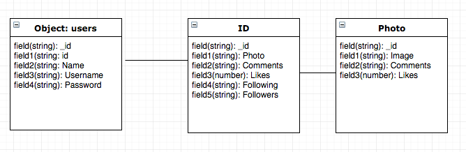
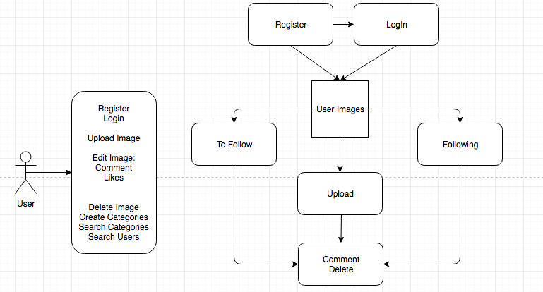
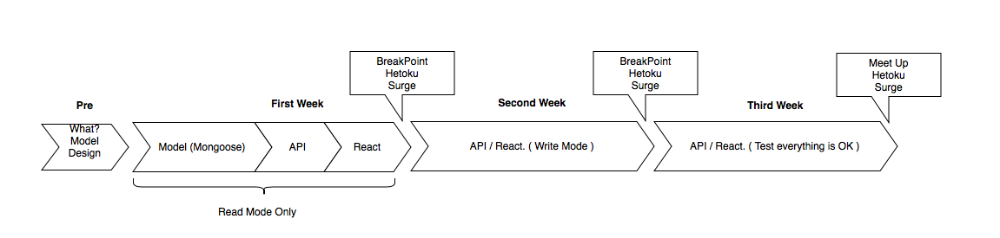
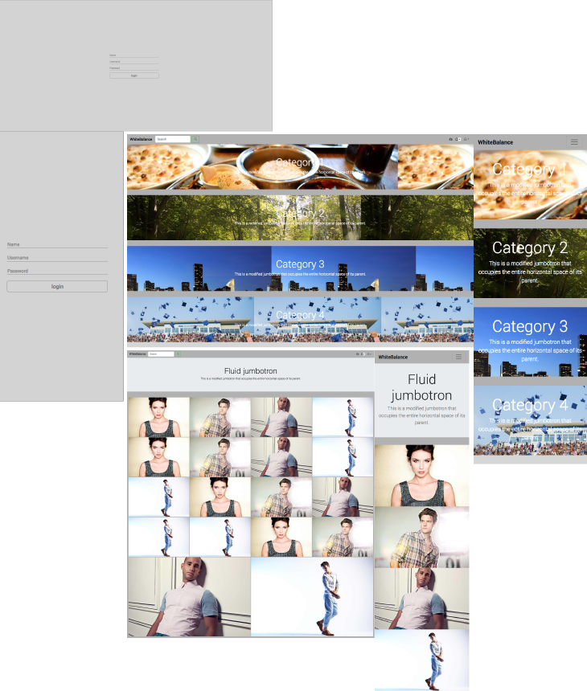

# WhiteBalance

Do you want to **share** your camera PoV with everebody? Do you like **photography** as much as Us?

Here you have the opportunity to show your **passion.**

## SURGE

## REPO GIT

- WhiteBalance (https://github.com/AlexGonRod/WhiteBalance)

## PREWORK

- 
- 
- 
- 

- WhiteBalance (https://github.com/AlexGonRod/WhiteBalance)

## MOCKUPS

- HTML AND CSS 

 

## WHAT IT'S USED

- Framework: React Material-UI
- REACT
- REACT Hash Router
- REACT Photo Gallery
- Some React Components
- JASMINE
- MongoDB
- Mongoose
- EXPRESS
- PASSPORT

## COMPONENT TREE

* Log In/Register
    * Main App
        * Landing Page
            * User Page
            * User Profile

- **LogIn/Register:** a kind of Splash Screen, the first thing that every user sees the first time.
- **Main App**: this main component renderizes every single component.
- **Landing Page:** The main page when a user has logged in. He can see some **categories.**
- **User Page:** User only sees his follower's pictures
- **User profile:** A page where user changes his data.

## DEVELOPER

- Alex Gonzalez (https://github.com/AlexGonRod)

