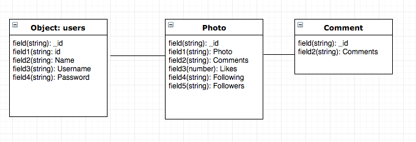

# WhiteBalance

Do you want to **share** your camera PoV with everebody? Do you like **photography** as much as Us?

Here you have the opportunity to show your **passion.**

## SURGE

- WhiteBalance (http://whitebalance.surge.sh/)

## PREWORK

## REPO GIT

- WhiteBalance (https://github.com/AlexGonRod/WhiteBalance)

## MOCKUPS

- HTML AND CSS 

 

## WHAT IT's BEING USED

- Framework: Bootstrap 4
- REACT
- REACT Hash Router, Router, WithRouter
- Some React Components
- MOCHA
- MongoDB
- Mongoose
- EXPRESS
- JSON Web Token

## COMPONENT TREE

* Log In/Register
    * Main App
        * Landing Page
            * User Page
            * Following Page
            * People to follow
            * Upload Image

- **LogIn/Register:** a kind of Splash Screen, the first thing that every user sees the first time.

- **Main App**: this main component renderizes every single component.

- **Landing Page:** The main page when a user has logged in. He can see all components to be rendered.

- **User Page:** User only sees his pictures

- **Following :** A page where user sees following's pictures.

- **Following :** A page where user sees pictures from people to follow.

## DEVELOPER

- Alex Gonzalez (https://github.com/AlexGonRod)

