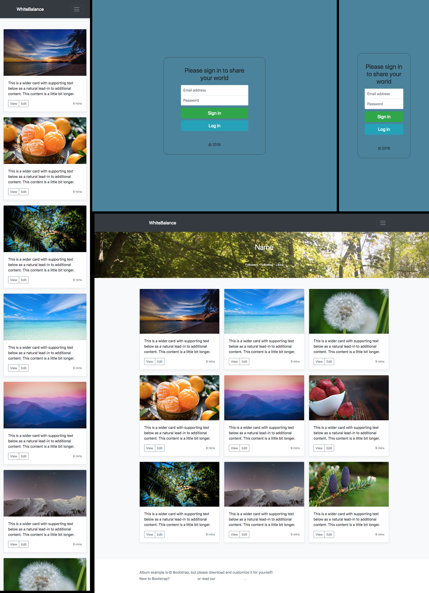

# WhiteBalance

Do you want to **share** your camera PoV with everebody? Do you like **photography** as much as Us?

Here you have the opportunity to show your **passion.**

## SURGE

## MOCKUPS

- HTML AND CSS 

 

## WHAT IT'S USED

- Frameworks: Bootstrap 4
- REACT
- REACT Hash Router
- REACT Photo Gallery
- SandBox
- JASMINE
- Some React Components
- MongoDB
- EXPRESS
- PASSPORT

## COMPONENT TREE

* Log In/Register
    * Main App
        * Landing Page
            * User Page
            * User Profile

- Main App: this main componetn renderizes every single component.
- LogIn/Register: a kind of Splash Screen, the first thing that every user sees the first time.
- Landing Page: The main page when a user has logged in. He can follow other users.
- User Page: User only sees his follower's pictures
- User profile: A page where user changes his data.

## DEVELOPER

- Alex Gonzalez (https://github.com/AlexGonRod)

